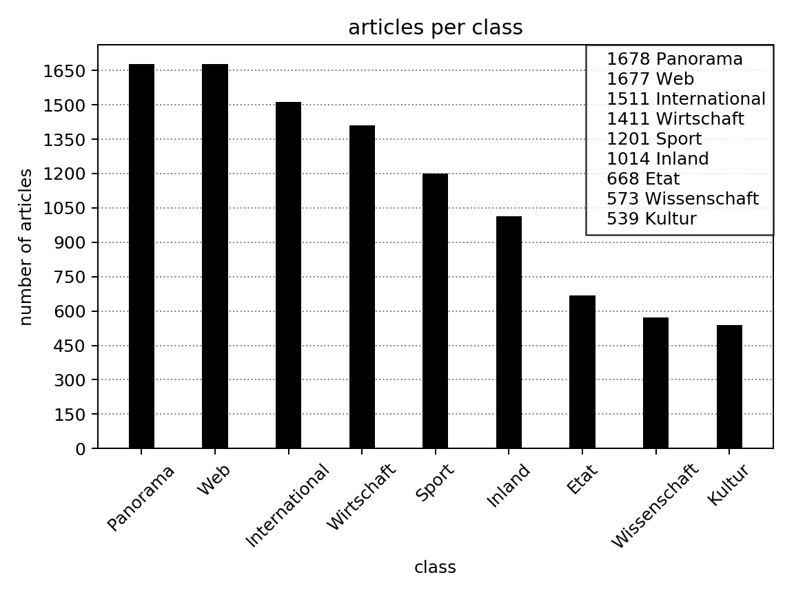
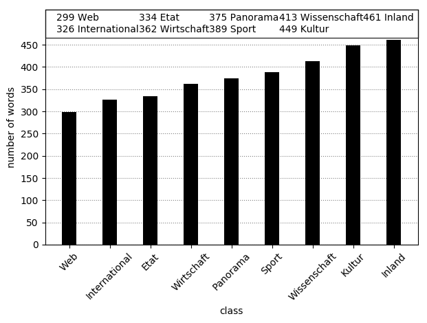

This page introduces the 10k German News Articles Dataset (10kGNAD) german topic classification dataset. 
The 10kGNAD is based on the [One Million Posts Corpus](https://ofai.github.io/million-post-corpus/) and avalaible under the [Creative Commons Attribution-NonCommercial-ShareAlike 4.0 International License](https://creativecommons.org/licenses/by-nc-sa/4.0/). You can download the dataset [here](https://github.com/tblock/10kGNAD).

## Why a German dataset? 

English text classification datasets are common.
Examples are the big AG News, the class-rich 20 Newsgroups and the large-scale DBpedia ontology datasets for topic classification and for example the commonly used IMDb and Yelp datasets for sentiment analysis.
Non-english datasets, especially German datasets, are less common.
There is a [collection](https://sites.google.com/site/iggsahome/downloads) of sentiment analysis datasets assembled by the Interest Group on German Sentiment Analysis. 
However, to my knowlege, no german topic classification dataset is avaliable to the public.  

Due to grammatical differences between the English and the German language, a classifyer might be effective on a English dataset, but not as effectiv on a German dataset.
The German language has a higher inflection and long compound words are quite common compared to the English language. 
One would need to evaluate a classifyer on multiple German datasets to get a sense of it's effectivness.

## The dataset 

The 10kGNAD dataset is intended to solve part of this problem as the first german topic classification dataset.
It consists of 10273 german language news articles from an austrian online newspaper categorized into nine topics.
These articles are a till now unused part of the [One Million Posts Corpus](https://ofai.github.io/million-post-corpus/).

In the [One Million Posts Corpus](https://ofai.github.io/million-post-corpus/) each article has a topic path. For example `Newsroom/Wirtschaft/Wirtschaftpolitik/Finanzmaerkte/Griechenlandkrise`.
The 10kGNAD uses the second part of the topic path, here `Wirtschaft`, as class label.
In result the dataset can be used for multi-class classification.

I created and used this dataset in my thesis to train and evaluate four text classifyers on the German language.
By publishing the dataset I hope to support the advancement of tools and models for the German language.
Additionally this dataset can be used as a benchmark dataset for german topic classification.  

### Numbers and statistics

As in most real-world datasets the class distribution of the 10kGNAD is not balanced.
The biggest class *Web* consists of 1678, while the smalles class *Kultur* contains only 539 articles.
However articles from the *Web* class have on average the fewest words, while artilces from the culture class have the second most words.
See below for a detailed overview over class size and average amount of words per class.

   |   

Articles per class
 | 
Average number of words per article per class
 

### Splitting into train and test

I propose a stratifyed split of 10% for testing and the remaining articles for training.
To use the dataset as a benchmark dataset, please used the `train.csv` and `test.csv` files located in the project root.
The table below shows an overview of the train-test-split.

  | Category | Train | Test | Combined |
  | :---: | :-----: | :----: | :--------: |
  | Web                  | 1510  | 168  | 1678     |
  | Panorama             | 1509  | 168  | 1677     |
  | International        | 1360  | 151  | 1511     |
  | Wirtschaft           | 1270  | 141  | 1411     |
  | Sport                | 1081  | 120  | 1201     |
  | Inland               | 913   | 102  | 1014     |
  | Etat                 | 601   | 67   | 668      |
  | Wissenschaft         | 516   | 57   | 573      |
  | Kultur               | 485   | 54   | 539      |

## Code

Python scripts to extract the articles and split them into a train- and a testset avaliable in the [code directory](https://github.com/tblock/10kGNAD/tree/master/code) of this project.
Make sure to install the [requirements](https://github.com/tblock/10kGNAD/blob/master/requirements.txt).
The original `corpus.sqlite3` is required to extract the articles (download [here (compressed)](https://github.com/OFAI/million-post-corpus/releases/download/v1.0.0/million_post_corpus.tar.bz2) or [here (uncompressed)](https://github.com/tblock/10kGNAD/releases/download/v1.0/corpus.sqlite3)).

## License

This dataset is licensed under a [Creative Commons Attribution-NonCommercial-ShareAlike 4.0 International License](http://creativecommons.org/licenses/by-nc-sa/4.0/).
Please consider citing the [authors of the One Million Post Corpus](https://ofai.github.io/million-post-corpus/#citation) if you use the dataset. 

